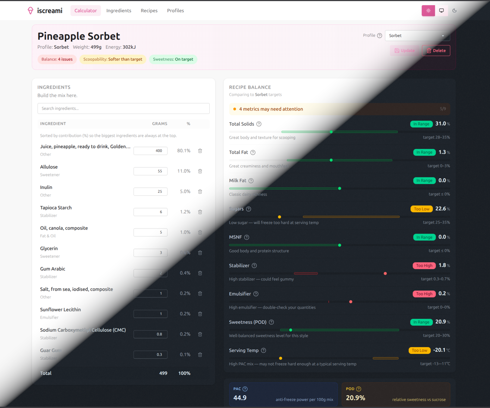

# iscreami — Ice Cream Recipe Calculator

Open-source ice cream recipe formulator. Add ingredients and get real-time feedback on freezing properties, sweetness, composition, and nutrition.

> **Note:** This project is in early development. Expect bugs, missing features, and breaking changes. Contributions are welcome; please open a discussion.

<a href="docs/screenshot-calculator.png" target="_blank" rel="noopener noreferrer">
	
</a>

## What it does

- **Recipe calculator** - build a recipe ingredient by ingredient; metrics update live as you type
- **PAC (Potere AntiCongelante)** - measures freezing point depression so you know how hard your mix will freeze
- **Freezing curve** - visualises frozen water % vs. temperature across the serving range
- **POD (Potere Dolcificante)** - relative sweetness vs. sucrose, with a per-ingredient breakdown
- **Nutrition facts** - per 100g and per serving
- **Target profiles** - compare your recipe against Ice Cream, Gelato, Sorbet, and Sherbet reference ranges
- **Ingredient library** - ~40 seeded common ice cream ingredients; import more from USDA or the NZ Food Composition Database

## Why it exists

There are a few ice cream recipe calculators out there, but none (that I found) that were open-source and self-hostable. I wanted to build something that I could run locally, customize, and contribute to.

Currently designed for a single/shared user i.e. no authentication implemented. This may come in the future, but for now it's designed to be run locally or on a private network.

## About the name

**iscreami** is a mashup of "is it creamy?" and "ice-cream"

Pronounce it as you wish - "is-creamy", "ice-creamy".

## AI Involvement

Portions of this app were developed with AI assistance (Claude / GPT / Copilot), under human developer oversight.
AI was used for both code generation and some design decisions. You can call it vibe-coded, though I do not consider it fully AI-generated.
The project is based on similar work I have written in the past, and all code is human-reviewed and tested.

## Running it

Requires PostgreSQL and is served from a single Docker container:

```bash
cp .env.example .env
# Set DATABASE_URL in .env, then:
docker build -t iscreami .
docker run -e DATABASE_URL=postgresql://user:pass@db:5432/iscreami -p 8000:8000 iscreami
```

Open **http://localhost:8000** in your browser.

For local development without Docker, see [CONTRIBUTING.md](CONTRIBUTING.md).

## Contributing

See [CONTRIBUTING.md](CONTRIBUTING.md) for setup instructions, the development workflow, and links to the backend/frontend developer guides.

## License

Licensed under the GNU Affero General Public License v3.0 (AGPL-3.0). See [LICENSE](LICENSE) for details.
